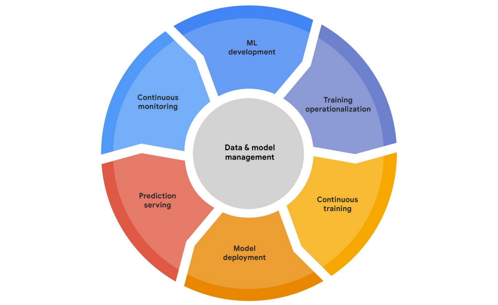

# Full MLOps lifecycle for tabular datasets.

This repository aims to solve the mlops lifecycle of a machine learning application focused on a tabular dataset.

This project gives the full implementation of the full data and model management on a Google Cloud environment using services like Vertex AI, Dataflow, Bigquery, and others.

## Observations
As far as I consider IAM policies important, this project simplify this to focus on the infrastructure. No IAM setup will be provided. However, a file in this repository will be referenced with the permissions that each role (mentioned after this section) should have at least for the solution to work properly.

## Roles
This project assumes that there are working roles for the lifecycle of the project. These are described next:
- Data Analyst: This role is in charge of preparing the raw data to the data science team. As an abstraction, the data analyst takes the data from it's source and clean it to save it using CSV format.
- Data Scientist: This role is in charge of modelling and training. As part of it's processing, EDA is also made by this role.
- Quality Assurance: This role test the models served on an staging environment. Also, makes the pushes to the main status of the project to serve the models into production.
- Machine Learning Engineer: This role orchestrates all of the MLOps cycle and sets the CI/CD procedures.
- Stakeholder: This role review the final process, monitoring views and model results.

## Workflow
To prepare the workflow, the MLE team sets an environment using Google Cloud services and Github services (repositories and GH Actions). This ensures the quick development and production of the models.
Each step of the workflow is presented next:

- Data Ingestion: Data Analyst uses -out of scope- processes to extract the data from sources and clean it. Finally, the Data Analyst uploads the data as CSV (as part of a storing policy) into a Google Cloud Storage Bucket. A Cloud Function triggers each time a CSV is uploaded to verify the integrity of the data to upload it to a BigQuery dataset.
- Data Exploration: With the data available on Bigquery, data science team can start an iterative exploration. Vertex AI's Workbech instaces are recommended (for collaborative exploration), but not required for this step.
- Data Training: A Vertex AI's Pipeline is used to setup all the processing required for load the data, store artifacts and models and finally serve the trained model into an staging endpoint.
- Model Evaluation: The model is evaluated by QA team by testing the endpoints (Workflow out of scope).
- Model Serving to production: The model is finally tested to serve the model into a production endpoint.