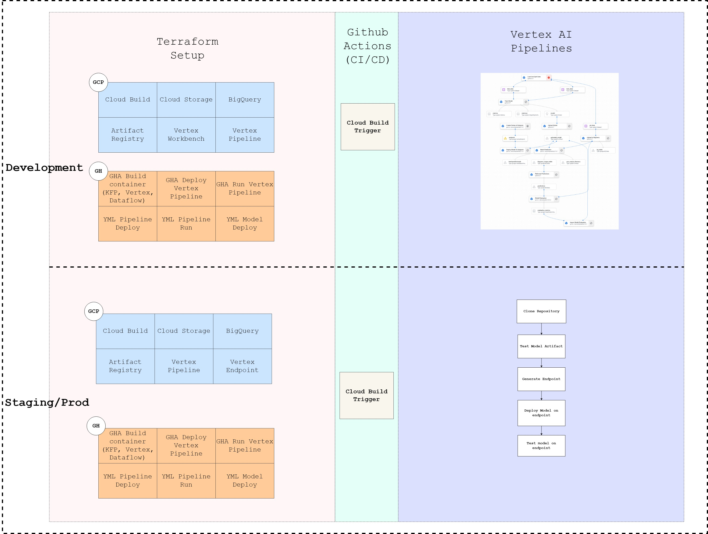

# KF Pipeline with Vertex AI's Pipelines
This Python code defines a Kubeflow Pipeline for end-to-end machine learning workflow using Google Cloud services. The pipeline involves data loading, model training, model deployment, online endpoint creation, evaluation, and model monitoring.



## Prerequisites
Before running the pipeline, ensure you have:

- Access to a Google Cloud Platform (GCP) project with necessary permissions.
- Required Python packages installed, which are listed in requirements.txt.
## Setup
1. Google Cloud Project Setup: Make sure you have set up your GCP project and have the necessary APIs enabled.
2. Service Account Setup: Create a service account with appropriate permissions and generate a key file. Update the SERVICE_ACCOUNT variable in config.py with the path to this key file.
3. Pipeline Configuration: Update the configuration details in config.py with your project-specific information, such as project ID, region, dataset names, etc.
## Usage

Execute the following command to compile and run the pipeline:

```bash
python main.py
```

By default, the pipeline will compile and run all the components. If you only want to compile the pipeline without execution, use the --compile-only flag.

## Pipeline Components
1. Data Loading: Load and split data from BigQuery into train and test datasets.
2. Model Training: Train a machine learning model using the provided training data.
3. Model Deployment: Deploy the trained model to an online endpoint for real-time predictions.
4. Model Evaluation: Evaluate the model's performance using the test dataset. Metrics are computed and imported into the Vertex AI model registry.
5. Batch Prediction: Perform batch predictions on a separate dataset using the deployed model.
